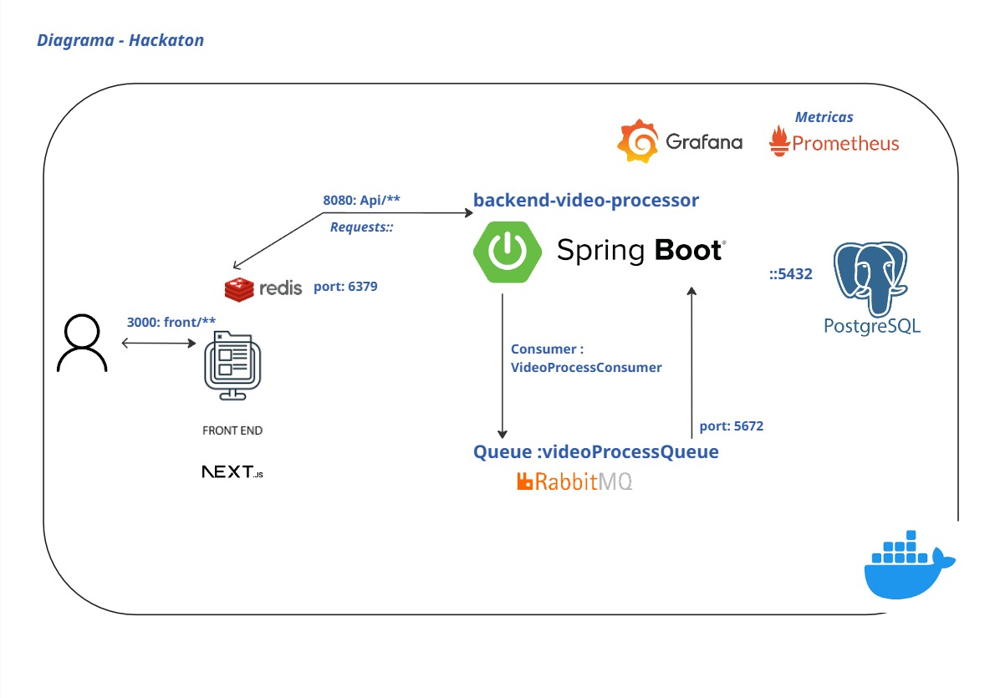

# FIAP Hackathon - Video Processor

## Luis Antônio de Melo Gomes

**Matricula : rm359104**

**Github: https://github.com/LuisAntonioDeMelo/hackathon-soat-videoProcessing
video:  https://youtu.be/y_c0BvZYVFk**


## Arquitetura Completa do Sistema

---

## **Diagrama da Arquitetura**



---

## 🔄 **Fluxo de Dados**

### 1. **Upload de Vídeo**

```
Usuário → Frontend → Backend → PostgreSQL (metadata)
                  ↓
            RabbitMQ Queue → Processamento Assíncrono
                  ↓
            FFmpeg → Extração de Frames → Storage (ZIP)
```

### 2. **Consulta de Status**

```
Frontend → Backend → Redis (cache) → PostgreSQL (fallback)
       ← Backend ← Redis ← PostgreSQL
```

### 3. **Visualização de Frames**

```
Frontend → Backend → Storage (ZIP) → Extração dinâmica → Cache → Usuário
```

### 4. **Monitoramento**

```
Todos os Serviços → Prometheus → Grafana → Dashboards/Alerts
```

---

## 📊 **Especificações Técnicas**

### **Frontend (Next.js)**

- **Port**: 3000
- **Technology**: React 18, TypeScript, Tailwind CSS
- **Build**: Multi-stage Docker com otimizações
- **Features**: SSR, Client-side hydration, Responsive design

### **Backend (Spring Boot)**

- **Port**: 8080
- **Technology**: Java 17, Spring Boot 3.x, Maven
- **Architecture**: RESTful API, Async processing
- **Monitoring**: Actuator endpoints, Prometheus metrics

### **Database (PostgreSQL)**

- **Port**: 5446
- **Version**: 15-alpine
- **Storage**: Persistent volume
- **Configuration**: Optimized for development

### **Cache (Redis)**

- **Port**: 6379
- **Version**: 7.2-alpine
- **Mode**: Standalone with persistence
- **Usage**: Session cache, API response cache

### **Message Broker (RabbitMQ)**

- **Port**: 5672 (AMQP), 15672 (Management)
- **Version**: 3.12-management-alpine
- **Features**: Management UI, Persistent queues

### **Monitoring (Prometheus)**

- **Port**: 9090
- **Version**: v2.48.0
- **Storage**: Persistent time-series data
- **Targets**: All services monitored

### **Dashboards (Grafana)**

- **Port**: 3001
- **Version**: 10.2.0
- **Credentials**: admin/grafana123
- **Features**: Pre-configured dashboards, alerts

---

## 🌐 **URLs de Acesso**

| Serviço              | URL                                   | Credenciais      |
| --------------------- | ------------------------------------- | ---------------- |
| **Frontend**    | http://localhost:3000                 | -                |
| **Backend API** | http://localhost:8080                 | -                |
| **Swagger UI**  | http://localhost:8080/swagger-ui.html | -                |
| **Grafana**     | http://localhost:3001                 | admin/grafana123 |
| **Prometheus**  | http://localhost:9090                 | -                |
| **RabbitMQ**    | http://localhost:15672                | admin/admin      |

---

## 🔧 **Comandos de Gerenciamento**

### **Inicialização**

```bash
docker compose up --build -d
```

### **Parar Todos os Serviços**

```bash
docker compose down
```

### **Ver Logs**

```bash
docker compose logs -f [nome-do-servico]
```

### **Rebuild Completo**

```bash
docker compose down
docker compose up --build
```

### **Scripts Windows**

```powershell
.\start-app-simple.ps1    # Inicializar com verificações
.\stop-app.ps1            # Parar todos os serviços
```

---

## 🚀 **Características da Solução**

### ✅ **Pontos Fortes**

- **Arquitetura Moderna**: Microserviços com separação clara de responsabilidades
- **Observabilidade Completa**: Monitoramento e alertas em tempo real
- **Performance Otimizada**: Cache Redis e processamento assíncrono
- **Escalabilidade**: Design preparado para crescimento horizontal
- **DevOps Ready**: Pipeline CI/CD automatizado
- **Containerização**: Docker compose para consistência entre ambientes
- **Persistent Storage**: Todos os dados importantes persistidos

### 📈 **Métricas Monitoradas**

- **Application**: Response time, throughput, error rates
- **Infrastructure**: CPU, memory, disk usage
- **Database**: Connections, query performance
- **Cache**: Hit ratio, memory usage
- **Queue**: Message rates, queue depth

### 🛡️ **Segurança**

- **Network Isolation**: Services comunicam via rede Docker interna
- **Health Checks**: Monitoramento contínuo de saúde dos serviços
- **Environment Variables**: Configuração segura via variáveis
- **Non-root Users**: Containers executam com usuários sem privilégios

---

**📅 Data**: Julho :2025
